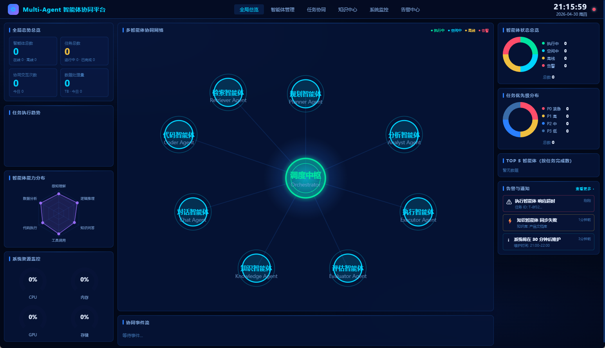

> 🌐 **中文** &nbsp;|&nbsp; [English](./README_EN.md)

# Multi-Agent 智能体协同平台 v2

<p align="center">
  
</p>

基于 Hermes (Ollama) 的多智能体统一管理平台，带实时看板监控与持久化存储。

## 架构

```
前端看板 (frontend/index.html)
  WebSocket 实时推送 · Chart.js · 中英文切换 · 6 页完整导航
        ↕ WS / REST
FastAPI 后端 (backend/main.py)
  SQLite 持久化 · 33 个 API 端点 · 告警规则引擎 · 流式 LLM · 消息路由
        ↕ HTTP
Ollama / Hermes          你的智能体 (sdk/agent_sdk.py)
  本地 LLM 推理          注册 · 心跳 · 任务 · 多轮对话 · 工具调用
```

## 快速开始

```bash
chmod +x scripts/start.sh
./scripts/start.sh
# 另一个终端:
source .venv/bin/activate
python scripts/demo_agents.py
```

## v2 新增功能

| 模块 | 新增 |
|------|------|
| 后端 | SQLite 持久化（重启不丢数据）|
| 后端 | 知识库 CRUD API + 同步触发 |
| 后端 | 告警规则 API + 自动检测引擎 |
| 后端 | 智能体间消息路由 + 收件箱 |
| 后端 | 流式 LLM（SSE）|
| 后端 | 真实系统资源（psutil）|
| 后端 | 任务搜索/过滤/分页 |
| SDK | 断线自动重连 |
| SDK | `llm_stream()` 流式输出 |
| SDK | `llm_with_tools()` 工具调用 |
| SDK | 多轮对话（`remember=True`）|
| SDK | `send_message()` / `get_inbox()` |
| SDK | `@agent.tool()` 装饰器 |
| 前端 | 知识库/告警数据对接真实 API |
| 前端 | 中英文无缝切换（32 组 i18n 键）|
| 前端 | 6 页完整导航（含告警规则管理）|

## API 速查

```
POST /api/agents/register          注册智能体
POST /api/agents/{id}/heartbeat    心跳
POST /api/agents/{id}/message      发消息
GET  /api/agents/{id}/inbox        收件箱
POST /api/tasks                    创建任务
POST /api/tasks/{id}/complete      完成任务
GET  /api/knowledge                知识库列表
POST /api/knowledge/{id}/sync      触发同步
GET  /api/alerts/rules             告警规则
POST /api/alerts/rules             新增规则
POST /api/chat                     LLM 推理（支持流式）
GET  /api/stats                    全局快照
WS   /ws                           实时推送
GET  /health                       健康检查
GET  /docs                         Swagger UI
```

## SDK 速查

```python
from sdk.agent_sdk import AgentClient, AnalystAgent

agent = AgentClient(name="我的智能体", role="analyzer")

# 单次 LLM
answer = await agent.llm("分析这段数据...")

# 多轮对话
await agent.llm("问题1", remember=True)
await agent.llm("追问", remember=True)
agent.clear_history()

# 流式输出
async for token in agent.llm_stream("生成报告..."):
    print(token, end="", flush=True)

# 工具调用
@agent.tool(name="calc", description="计算表达式")
async def calc(expr: str) -> str:
    return str(eval(expr))
result = await agent.llm_with_tools("计算 (100+50)*3/5")

# 消息
await agent.send_message(other_agent_id, "请协助处理任务")
msgs = await agent.get_inbox()
```
